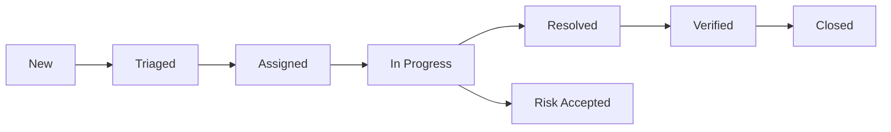

This guide provides best practices for using VulnTrack effectively in your security operations.

## Vulnerability Management

### Vulnerability Discovery and Import

<Steps>
  <Step title="Leverage CVE Import Engine">
    Use VulnTrack's automated CVE import to fetch vulnerability data from NIST NVD or VulnCheck integration.
    
    - Schedule regular imports for newly disclosed vulnerabilities
    - Configure filters to match your technology stack
    - Review imported CVEs for applicability to your environment
  </Step>

  <Step title="Manual Vulnerability Entry">
    For custom applications and internal discoveries:
    
    - Document all relevant technical details
    - Include proof-of-concept or steps to reproduce
    - Attach screenshots, logs, or network captures
    - Reference related CVEs when applicable
  </Step>

  <Step title="Deduplicate Findings">
    Before creating new vulnerabilities:
    
    - Search existing database for similar issues
    - Check for related CVEs or vendor advisories
    - Link related vulnerabilities together
    - Consolidate duplicate findings
  </Step>
</Steps>

<Tip>
Create vulnerability templates for common finding types to ensure consistent documentation across your team.
</Tip>

### Vulnerability Lifecycle Management

Establish clear states and transitions for vulnerability tracking:

**Key States:**

- **New**: Unreviewed vulnerability
- **Triaged**: Risk assessed, priority assigned
- **Assigned**: Owner designated
- **In Progress**: Active remediation
- **Resolved**: Fix deployed
- **Verified**: Fix confirmed effective
- **Risk Accepted**: Documented decision not to remediate
- **Closed**: Lifecycle complete

<Info>
Document risk acceptance decisions with clear justification, compensating controls, and review dates.
</Info>

## Risk Assessment Strategy

### Multi-Framework Approach

Combine frameworks for comprehensive risk assessment:

<CardGroup cols={2}>
  <Card title="Use CVSS for Baseline" icon="chart-simple">
    Start with CVSS scores from CVE imports to establish industry-standard severity
  </Card>

  <Card title="Apply DREAD for Context" icon="calculator">
    Add organizational context with DREAD scoring based on your environment
  </Card>

  <Card title="Tag with STRIDE" icon="tags">
    Categorize threats to identify patterns and architectural weaknesses
  </Card>

  <Card title="Map to OWASP Top 10" icon="list">
    Track exposure to common web application risks for compliance
  </Card>
</CardGroup>

### Environmental Factors

Adjust risk scores based on your environment:

**Increase Priority:**
- Internet-facing systems
- Systems processing sensitive data
- High-availability production systems
- Components with known active exploits
- Systems lacking compensating controls

**Decrease Priority:**
- Internal development environments
- Isolated test systems
- Systems with strong defense-in-depth
- Components scheduled for decommissioning
- Vulnerabilities requiring physical access

<Warning>
Never ignore vulnerabilities entirely. Even low-priority issues should be tracked and periodically reviewed.
</Warning>

### Risk Scoring Calibration

Regularly calibrate your risk scoring approach:

1. **Review Past Decisions**: Analyze previously scored vulnerabilities and actual impact
2. **Team Consensus**: Ensure consistency in scoring across team members
3. **Benchmark External Data**: Compare against industry incidents and exploit trends
4. **Document Exceptions**: Record when and why scores were adjusted

## Team Workflows

### Role-Based Access Control

VulnTrack supports three primary roles:

<AccordionGroup>
  <Accordion title="Admin">
    **Capabilities:**
    - Full system access
    - User and team management
    - Generate invitation links
    - Configure system settings
    - Access all workspaces
    
    **Best For:** Security leadership, team leads, system administrators
  </Accordion>

  <Accordion title="Analyst">
    **Capabilities:**
    - Create and edit vulnerabilities
    - Assign tasks to team members
    - Generate reports
    - Access assigned workspaces
    - Score and prioritize issues
    
    **Best For:** Security analysts, penetration testers, security engineers
  </Accordion>

  <Accordion title="Viewer">
    **Capabilities:**
    - Read-only access to vulnerabilities
    - View reports and dashboards
    - Access assigned workspaces
    - Comment on existing issues
    
    **Best For:** Developers, managers, auditors, compliance teams
  </Accordion>
</AccordionGroup>

### Team-Based Workspaces

Organize work using team-based workspaces:

**By Application:**
- Web Application Team
- Mobile Platform Team
- Infrastructure Team
- Cloud Services Team

**By Function:**
- Penetration Testing
- Bug Bounty Program
- Compliance & Audit
- Incident Response

**By Business Unit:**
- Product Division A
- Product Division B
- Corporate IT
- Partner Integrations

<Tip>
Use workspace permissions to control access to sensitive vulnerability information and maintain separation between different security programs.
</Tip>

### Collaboration Best Practices

1. **Communication**
   - Use comments for status updates and questions
   - Tag team members for visibility
   - Document all remediation attempts
   - Share lessons learned

2. **Assignment**
   - Assign clear ownership for each vulnerability
   - Set realistic remediation deadlines
   - Track workload across team members
   - Escalate blocked items promptly

3. **Knowledge Sharing**
   - Reference VulnTrack Research blog articles
   - Create internal documentation links
   - Share proof-of-concept code securely
   - Conduct post-remediation reviews

## Remediation Prioritization

### Priority Matrix

Use a risk-based priority matrix for remediation planning:

| Priority | Criteria | Target Timeline |
|----------|----------|----------------|
| **P0 - Critical** | CVSS 9.0+, public exploit, internet-facing | 24-48 hours |
| **P1 - High** | CVSS 7.0-8.9, authenticated exploit, production | 7 days |
| **P2 - Medium** | CVSS 4.0-6.9, complex exploit chain | 30 days |
| **P3 - Low** | CVSS 0.1-3.9, requires physical access | 90 days |
| **P4 - Info** | No direct security impact | Next release cycle |

<Warning>
Adjust these timelines based on your organization's risk appetite and regulatory requirements.
</Warning>

### Remediation Strategies

<Tabs>
  <Tab title="Patch Management">
    **When to Use:** Vendor-provided security updates
    
    - Test patches in non-production environment
    - Schedule maintenance windows
    - Implement rollback procedures
    - Verify fix effectiveness post-deployment
  </Tab>

  <Tab title="Configuration Changes">
    **When to Use:** Security misconfigurations
    
    - Document current configuration
    - Test changes in isolated environment
    - Update configuration management system
    - Implement monitoring for drift
  </Tab>

  <Tab title="Code Remediation">
    **When to Use:** Custom application vulnerabilities
    
    - Perform secure code review
    - Write unit tests for the fix
    - Conduct security regression testing
    - Update secure coding guidelines
  </Tab>

  <Tab title="Compensating Controls">
    **When to Use:** Temporary mitigation or risk acceptance
    
    - Implement WAF rules or IDS signatures
    - Add network segmentation
    - Enhance monitoring and alerting
    - Schedule periodic control review
  </Tab>
</Tabs>

### Batch Remediation

Group similar vulnerabilities for efficient remediation:

- **By Component**: Patch all instances of vulnerable library
- **By Pattern**: Fix similar code issues across codebase
- **By System**: Address all findings on specific hosts
- **By Team**: Assign related issues to same developer

<Info>
Use VulnTrack's reporting engine to generate remediation batches and track progress across multiple vulnerabilities simultaneously.
</Info>

## Metrics and Reporting

### Key Performance Indicators

Track these metrics to measure program effectiveness:

**Volume Metrics:**
- Total vulnerabilities discovered
- Vulnerabilities by severity
- New vulnerabilities per month
- Backlog size and trend

**Time Metrics:**
- Mean time to detect (MTTD)
- Mean time to respond (MTTR)
- Mean time to remediate (MTTR)
- Age of open vulnerabilities

**Coverage Metrics:**
- Assets with active scanning
- Code coverage of security testing
- Percentage of systems patched
- Compliance gap analysis

### Executive Reporting

Generate executive-ready reports with VulnTrack:

- **Monthly Security Dashboard**: High-level metrics and trends
- **Critical Findings Brief**: Immediate attention items
- **Remediation Progress**: Status of ongoing fixes
- **Risk Posture**: Comparison to previous periods

<Tip>
Use VulnTrack's PDF and CSV export features to integrate vulnerability data with executive dashboards and compliance reports.
</Tip>

## Continuous Improvement

1. **Regular Reviews**
   - Weekly triage meetings
   - Monthly metrics review
   - Quarterly process improvements
   - Annual program assessment

2. **Process Optimization**
   - Automate repetitive tasks
   - Streamline approval workflows
   - Reduce false positives
   - Improve documentation

3. **Team Development**
   - Security training and certifications
   - Tool-specific training sessions
   - Threat intelligence briefings
   - Participation in security community

4. **Tool Enhancement**
   - Review VulnTrack Research blog for updates
   - Provide feedback on features
   - Customize workflows for your needs
   - Integrate with existing tools